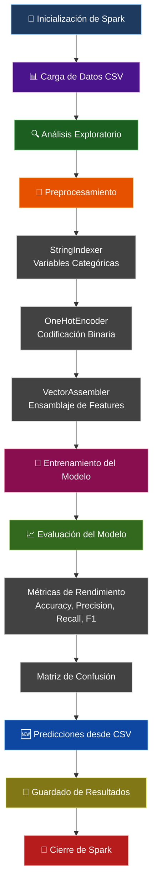

# 🏦 Clasificador de Ingresos con Spark ML

Este proyecto implementa un clasificador binario completo para predecir si una persona gana más de 50K al año usando regresión logística con Apache Spark ML. Incluye análisis exploratorio de datos, preprocesamiento avanzado, evaluación detallada del modelo y predicciones con datos nuevos.

## ✒️ Autores

> - Juan David Colonia Aldana - A00395956
> - Miguel Ángel Gonzalez Arango - A00395687

## 📋 Tabla de Contenido

- [🏦 Clasificador de Ingresos con Spark ML](#-clasificador-de-ingresos-con-spark-ml)
  - [✒️ Autores](#️-autores)
  - [📋 Tabla de Contenido](#-tabla-de-contenido)
  - [📋 Descripción del Proyecto](#-descripción-del-proyecto)
    - [🎯 Objetivos del Proyecto](#-objetivos-del-proyecto)
  - [🏗️ Estructura del Proyecto](#️-estructura-del-proyecto)
    - [📁 Descripción de Archivos](#-descripción-de-archivos)
  - [🚀 Instalación y Configuración](#-instalación-y-configuración)
    - [Prerrequisitos](#prerrequisitos)
    - [Instalación Rápida](#instalación-rápida)
  - [⚙️ Pipeline](#️-pipeline)
    - [Descripción del Pipeline](#descripción-del-pipeline)
  - [📊 Resultados y Salida del Programa](#-resultados-y-salida-del-programa)
    - [Archivos de Salida](#archivos-de-salida)
  - [🛠️ Personalización de Predicciones](#️-personalización-de-predicciones)
    - [Modificar Datos de Predicción](#modificar-datos-de-predicción)
    - [Formato Requerido](#formato-requerido)
    - [Ejemplo de Uso](#ejemplo-de-uso)

## 📋 Descripción del Proyecto

La empresa DataPros necesita construir un modelo robusto que permita predecir si una persona gana más de 50K al año basándose en características demográficas y laborales. El proyecto utiliza un dataset de 2000 registros simulados con las siguientes características:

- **age**: Edad de la persona (18-65 años)
- **sex**: Género (`Male`, `Female`)
- **workclass**: Tipo de empleo (`Private`, `Self-emp`, `Gov`)
- **fnlwgt**: Peso estadístico asociado al registro (20,129-399,891)
- **education**: Nivel educativo (`Bachelors`, `HS-grad`, `11th`, `Masters`, `Some-college`, `Assoc`)
- **hours_per_week**: Horas trabajadas por semana (20-60 horas)
- **label**: Clase objetivo (>50K o <=50K)

### 🎯 Objetivos del Proyecto

1. **Análisis Exploratorio**: Comprender la distribución y relaciones en los datos
2. **Preprocesamiento Robusto**: Transformar variables categóricas y numéricas
3. **Modelado Avanzado**: Implementar regresión logística con Spark ML
4. **Evaluación Completa**: Métricas detalladas de rendimiento del modelo
5. **Predicciones Prácticas**: Sistema para clasificar nuevos registros
6. **Documentación Técnica**: Código bien documentado y resultados guardados

## 🏗️ Estructura del Proyecto

```
income-classifier/
├── data/
│   ├── adult_income_sample.csv    # Dataset con 2000 registros
│   └── new_predictions.csv        # Datos nuevos para predicciones
├── src/
│   ├── income_classifier.py       # Clase principal del clasificador
│   └── utils.py                   # Utilidades para análisis y visualización
├── config/
│   └── spark_config.py            # Configuración optimizada de Spark
├── output/                        # Resultados y métricas del modelo
│   └── Results.md                 # Métricas detalladas guardadas
├── main.py                        # Script principal de ejecución
├── requirements.txt               # Dependencias de Python
└── README.md                      # Este archivo
```

### 📁 Descripción de Archivos

- **main.py**: Punto de entrada principal que ejecuta el análisis completo
- **src/income_classifier.py**: Clase principal con toda la lógica del clasificador
- **src/utils.py**: Funciones auxiliares para análisis exploratorio y evaluación
- **config/spark_config.py**: Configuración optimizada de Spark para Windows
- **data/adult_income_sample.csv**: Dataset principal con 2000 registros
- **data/new_predictions.csv**: Datos nuevos para realizar predicciones
- **output/**: Directorio donde se guardan automáticamente los resultados

## 🚀 Instalación y Configuración

### Prerrequisitos

- **Python 3.10**
- **Java 17** (requerido para Spark)
- **Apache Spark 3.5.0** (incluido en las dependencias de PySpark)

### Instalación Rápida

1. **Crear entorno virtual (recomendado)**

   ```bash
   python -m venv venv
   # En Windows:
   venv\Scripts\activate
   # En Linux/Mac:
   source venv/bin/activate
   ```

2. **Instalar dependencias**

   ```bash
   pip install -r requirements.txt
   ```

3. **Ejecutar**

   ```bash
   python main.py
   ```

## ⚙️ Pipeline



### Descripción del Pipeline

1. **🚀 Inicialización**: Configuración optimizada de Spark para el entorno local
2. **📊 Carga de Datos**: Lectura del dataset con validación de esquema
3. **🔍 Análisis Exploratorio**: Estadísticas descriptivas y distribuciones
4. **🔧 Preprocesamiento**: Transformación de variables categóricas y numéricas
   - StringIndexer para convertir texto a índices
   - OneHotEncoder para codificación binaria
   - VectorAssembler para combinar features
5. **🤖 Entrenamiento**: Regresión logística con regularización Elastic Net
6. **📈 Evaluación**: Cálculo de métricas y matriz de confusión
7. **🆕 Predicciones**: Lectura de datos desde `data/new_predictions.csv` y clasificación
8. **💾 Guardado**: Resultados exportados a `output/Results.md` en formato Markdown
9. **🛑 Cierre**: Liberación segura de recursos de Spark

## 📊 Resultados y Salida del Programa

### Archivos de Salida

## 🛠️ Personalización de Predicciones

### Modificar Datos de Predicción

Para cambiar los datos que se usan para nuevas predicciones, edita el archivo `data/new_predictions.csv`:

```csv
age,sex,workclass,fnlwgt,education,hours_per_week
25,Male,Private,150000,Bachelors,40
45,Female,Gov,200000,Masters,35
30,Male,Self-emp,180000,HS-grad,50
# Agrega más filas según necesites...
```

### Formato Requerido

| Campo              | Tipo   | Valores Válidos                                                    |
| ------------------ | ------ | ------------------------------------------------------------------ |
| **age**            | Entero | 18-65                                                              |
| **sex**            | Texto  | `Male`, `Female`                                                   |
| **workclass**      | Texto  | `Private`, `Self-emp`, `Gov`                                       |
| **fnlwgt**         | Entero | Peso estadístico (cualquier número entero)                         |
| **education**      | Texto  | `Bachelors`, `HS-grad`, `11th`, `Masters`, `Some-college`, `Assoc` |
| **hours_per_week** | Entero | 20-60                                                              |

### Ejemplo de Uso

1. **Editar el CSV**: Modifica `data/new_predictions.csv` con tus datos
2. **Ejecutar**: `python main.py`
3. **Ver resultados**: Las predicciones aparecerán en consola y se guardarán en `output/Results.md`
